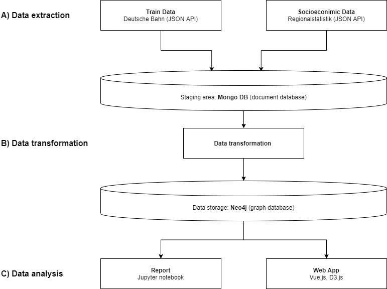

# Long distance trains in Germany

This project analyzes the long-distance train service in Germany. To achieve this, data from various sources will be collected, processed, stored and evaluated.

The main goal of the authors is to increase knowledge about graph databases and theory, working with APIs, and visualizing data. The content aspects (train analysis) are secondary.

In the following sections you will see a project overview. Please note that each process has its own detailed description provided as HTML file or Jupyter Notebook.

This project is created by:

* Adrian Weiss (GitHub: [SacrumDeus](https://github.com/SacrumDeus))
* Engelbert Ehret (GitHub: [ehrete](https://github.com/Ehrete))

# Structure

The project structure is shown in the figure below.

## Part A: Data extraction and preparation

The first step is to select and extract data from our sources. We used two data sources in our project.

The first data source is **Deutsche Bahn**, from which we extracted the timetable and station data using a JSON API. The detailed description for this part can be found at:

* HTML file: [dataDB.html](/dataDB.html)
* Jupyter notebook: [dataDB.ipynb](/dataDB.ipynb)

The second data source is the **Regionalstatistik** page, from which we extracted socio-economic data on German counties, also via JSON API. Detailed documentation is available at:

* HTML file: [regionalstatistik.html](/regionalstatistik.html)
* Jupyter notebook: [regionalstatistik.ipynb](/regionalstatistik.ipynb)

> **Note:** The original goal of the project was only to analyze train data from Deutsche Bahn. During the project work we came up with the idea to combine the train data with socio-economic data. In another project we already extracted socio-economic data from the site regionalstatistik (see [stepstone-analysis](https://github.com/SacrumDeus/python-stepstone-analysis)). Therefore, the notebook `regionalstatistik.ipynb` and the corresponding module were completely taken from the project of the other lecture and will be reused in this project.

The extracted data is stored in a Mongo DB database. We consider this as a staging area.

## Part B: Data transformation

The second step involves transporting the data from the Mongo DB to the Neo4j graph database. In this step, various nodes and edges with attributes are created in the database. The transport process requires various transformation steps. Detailed documentation is available at:

* HTML file: [createNeo4j.html](/createNeo4j.html)
* Jupyter notebook: [createNeo4j.ipynb](/createNeo4j.ipynb)

## Part C: Data analysis

The last step is data analysis. In this step **knowledge** is extracted from the data. Different graph algorithms are applied. The data analysis consists of a structured report (Jupyter notebook) and a web app (vue.js and D3.js).

The report is available at:
* HTML file: [01-data-selection](/01-data-selection.html)
* Jupyter notebook: [01-data-selection](/01-data-selection.ipynb)

The description of the web application can be found at:
* Dashboard [spa/README.md](/spa/README.md)

